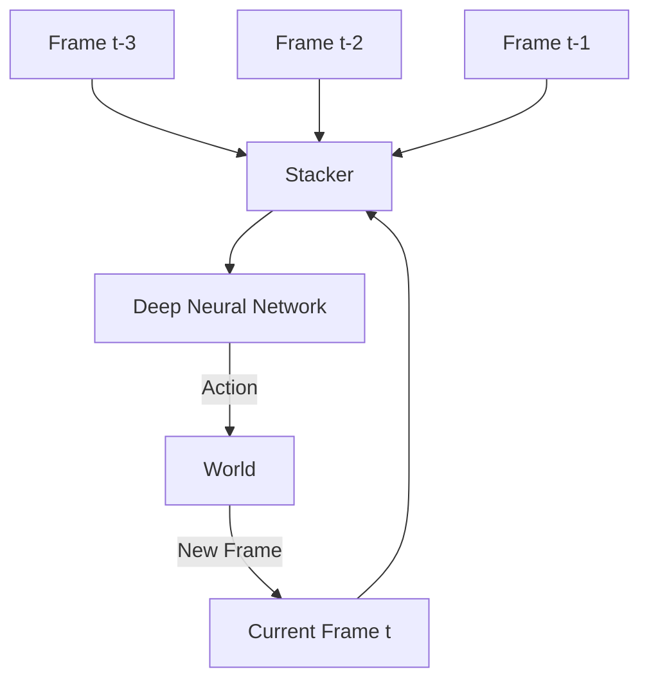

# Frame Stacking (Temporal Memory)

🧠 **What does this do? (The Analogy)**
Think of a **Photo of a Baseball**. If you look at one photo, you can't tell if the ball is moving left, right, or standing still. Now, think of a **Burst of 4 Photos**. If you see the ball moving across those 4 photos, you instantly know its **Speed** and **Direction**. **Frame Stacking** is how we give "Eyes" to an AI that can see time. We take the last 4 frames of a game and glue them together so the AI can "see" movement.

🔍 **Step-by-Step Explanation:**
1. **The Markov Property**: RL usually assumes the current state is all you need. But for video, one frame doesn't tell you the velocity.
2. **The Stack**: We store the last $N$ frames (usually 4) in a buffer.
3. **Channel Concatenation**: Instead of sending a $64 \times 64 \times 3$ image (RGB), we send a $64 \times 64 \times 12$ image (4 images stacked).
4. **Motion Perception**: The Convolutional Neural Network (CNN) can now "see" the difference between frame 1 and frame 4, allowing it to calculate speed internally.

📊 **High-Level Design (HLD)**

✅ **Why use this?**
It is the standard trick for **Atari Games**. Without frame stacking, an AI in a game like "Pong" wouldn't know if the ball was moving toward it or away from it. It is the cheapest and easiest way to add "Memory" to an AI without using complex Recurrent Networks (LSTMs).

🌍 **Real-World Examples:**
1. **Security Motion Detection**: Stacking 3 frames of video to detect the direction an intruder is walking.
2. **Autonomous Braking**: Stacking frames from a car camera to determine if the car in front is slowing down or accelerating.
