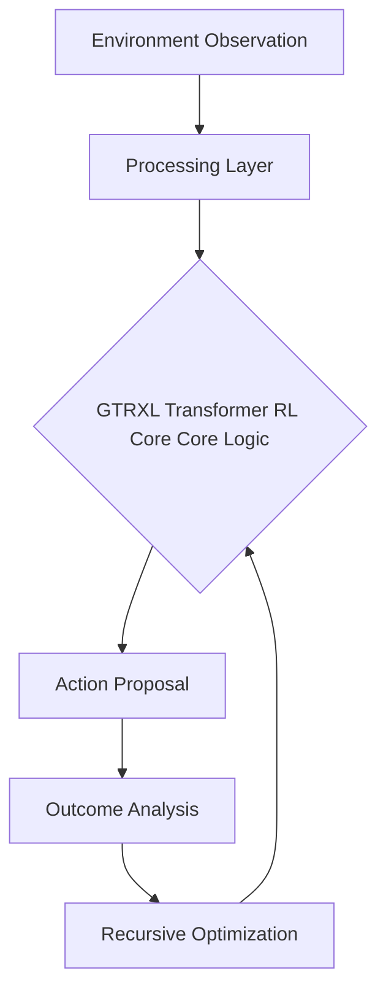

# GTRXL Transformer RL Core

## 🧠 The Analogy
**A researcher with a massive library of notebooks who uses 'Gated Attention' to decide which old notebook is relevant to the current experiment.**

## 🚀 Overview
Gated Transformer-XL (GTrXL) improves on standard transformers by using gating mechanisms to stabilize learning and increase memory capacity in RL.

## 🔍 Key Concepts
1. **Optimization**: Maximizing long-term reward through specific architectural choices.
2. **Stability**: Ensuring the agent doesn't 'forget' or 'diverge' during training.
3. **Efficiency**: Reducing the number of samples needed to reach expert performance.

## 📊 High-Level Design (HLD)

## ⚖️ Pros and Cons
| Pros | Cons |
| :--- | :--- |
| Long-term memory, stable training | Computationally expensive |

---
*Created for the Reinforcement Learning Encyclopedia Project.*
