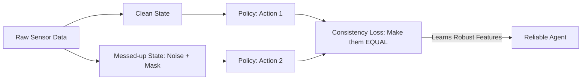

# Laskin State Augmentation RL

🧠 **What does this do? (The Analogy)**
Think of a **Pianist practicing with a blindfold on**. 
- They already know the keys. 
- By adding "Noise" (the blindfold), they force their brain to rely on the **Rhythm and Feeling** rather than just their eyes. 
**Laskin Augmentation** applies the success of image-based RL (RAD/DrQ) to standard numbers (Vectors). It adds random noise and "drops out" certain sensors during training, so the AI learns to be "Tough." If one sensor breaks in the real world, the AI doesn't panic—it has already practiced for that.

🔍 **Step-by-Step Explanation:**
1. **Gaussian Noise**: Small random values are added to the sensor data.
2. **Feature Masking**: 10% of the sensors are randomly "turned off" (set to zero).
3. **Consistency Regularization**: The AI is forced to give the same answer for the "Clean" state and the "Messy" state.
4. **Benefit**: It prevents "Overfitting" to a specific simulator. It is the best way to make a **Model-Free** agent stable.

📊 **High-Level Design (HLD)**

✅ **Why use this?**
It is the current **Top Trick** for winning RL competitions. It makes your agent 20-30% more robust without adding any new neural networks or complex math.

🌍 **Real-World Examples:**
1. **Robotic Balancing on Uneven Ground**: Training a robot dog so that even if its "Leg Sensors" are slightly off, it still knows how to stay upright.
2. **Autonomous Drones in Wind**: Learning to ignore small "sensor jitters" caused by motor vibrations.
