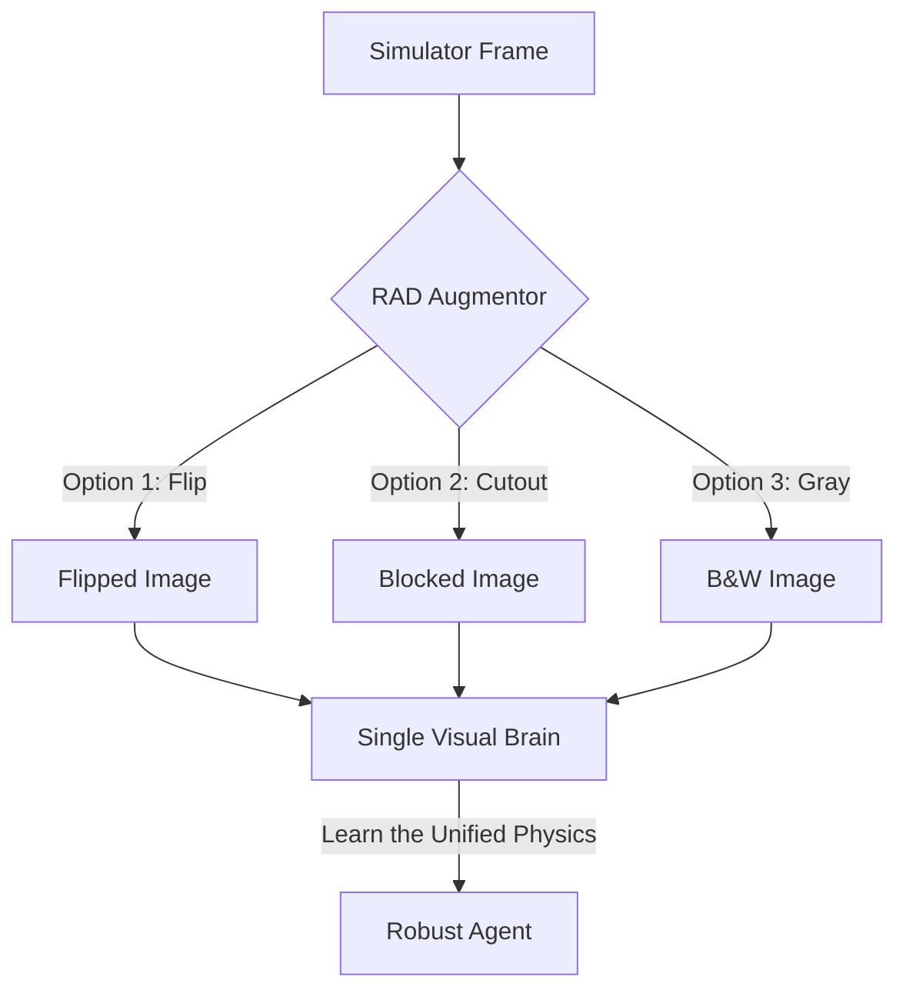

# RAD (Reinforcement Learning with Data Augmentation)

🧠 **What does this do? (The Analogy)**
Think of a **Goalie training for Soccer**. 
- On Monday, they train in the sun. 
- On Tuesday, they train in the rain. 
- On Wednesday, they train with a red ball. 
- On Thursday, they train with a blue ball. 
By the end of the week, the goalie doesn't care about the weather or the color of the ball—they only care about the **Movement** of the ball. **RAD** is an AI that trains on "Messed-up" images (Random crops, colors, and cutouts) so it learns to ignore the "Background Noise" and focus only on the task.

🔍 **Step-by-Step Explanation:**
1. **The Library**: A set of 10+ visual transformations (Crop, Grayscale, Color Jitter, Horizontal Flip, Cutout, etc.).
2. **Random Perturbation**: Every time the AI looks at a frame, the frame is randomly changed.
3. **Invariance Learning**: The AI learns that the "Value" of a state is the same even if the colors are different.
4. **Benefit**: It allows the AI to generalize. An AI trained in a "Green Room" simulator can suddenly work in a "Blue Room" in the real world without any extra training.

📊 **High-Level Design (HLD)**

✅ **Why use this?**
It is the most successful algorithm for **Sim-to-Real Transfer**. If you want a robot that was trained in a computer game to work in a real-world messy house, you MUST use RAD.

🌍 **Real-World Examples:**
1. **Industrial Robotics**: Training a robot to recognize parts even if there are shadows, oil stains, or different metal reflections.
2. **Autonomous Drone Flight**: Learning to fly through a forest by being robust to different leaf colors and sun-glare.
