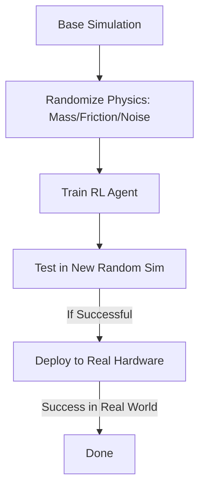

# Sim-to-Real (Domain Randomization)

🧠 **What does this do? (The Analogy)**
Think of a **Pilot training in a flight simulator**. If the simulator is always perfect, the pilot will panic when they hit real turbulence or a rainy day. **Domain Randomization** is like a simulator that **randomly breaks things**. It changes the wind, makes the controls sticky, changes the lighting, and makes the plane heavier. If the pilot learns to fly in that "Crazy Simulator," then flying a real plane in the real world is **easy** because they have already seen every possible weird situation.

🔍 **Step-by-Step Explanation:**
1. **The Reality Gap**: Simulators are never 100% accurate. Robots trained in "perfect" sim often fail in the "messy" real world.
2. **Parameter Randomization**: Every time the agent starts a new training episode, we randomly change the physics:
   - Friction of the floor.
   - Weight of the robot's arm.
   - Latency (delay) of the motors.
   - Color and lighting of the room.
3. **Robustness**: The agent is forced to learn a policy that works **across all these variations**.
4. **Zero-Shot Transfer**: When you put the agent on a real robot, it "thinks" the real world is just another variation of the simulation and works perfectly immediately.

📊 **High-Level Design (HLD)**

✅ **Why use this?**
It is the only way to train **Advanced Robotics** today. OpenAI used this to train a robotic hand to solve a Rubik's Cube. By randomizing everything from the size of the cube to the color of the table, the robot became robust enough to handle the real world.

🌍 **Real-World Examples:**
1. **Robotic Hand Manipulation**: Training a hand to pick up objects where the "slippery-ness" of the object is unknown.
2. **Autonomous Delivery Drones**: Training drones to fly in simulation where the "Wind Strength" and "GPS Noise" are randomized every second, ensuring they stay stable in real storms.
