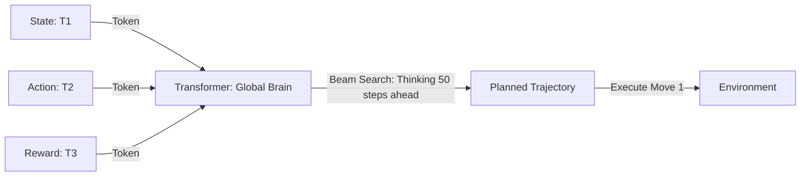

# Trajectory Transformer (Global Planning)

🧠 **What does this do? (The Analogy)**
Think of a **GPS for AI**. 
- A normal AI (like PPO) is like a driver who only looks at the car in front of them (Local View). 
- **Trajectory Transformer** is the GPS that looks at the **Whole City** (Global View). 
- It turns the robot's life into a "Book." It reads the "First Chapter" (The start of the mission) and then uses **Beam Search** to find the most likely "Final Chapter" (The High Score). 
It doesn't just guess the next step; it "Calculates" the entire future path as a single sequence of tokens, making it much better at solving complex mazes and long-term puzzles.

🔍 **Step-by-Step Explanation:**
1. **Discretization**: Every number (Position, Velocity, Action) is converted into a discrete "Token" (like a word in English).
2. **Transformer Backbone**: A massive GPT-style model learns to predict the next token in the "Trajectory Sentence."
3. **Beam Search**: Instead of picking the "most likely" next step, it explores 5-10 different "Future Sentences" simultaneously and picks the one with the highest total reward.
4. **Benefit**: It can perform **Zero-Shot Planning**. You can give it a goal it has never seen before, and it will "search" its language-model brain to find a path to reach it.

📊 **High-Level Design (HLD)**

✅ **Why use this?**
It is the best choice for **Long-Horizon Logic**. If your task requires 1,000 steps to complete and a single mistake early on ruins everything (like a Maze or a Rubik's Cube), the Trajectory Transformer's "Global View" is significantly better than any other RL method.

🌍 **Real-World Examples:**
1. **Maze Navigation**: Solving 3D mazes by "reading" the path like a sentence.
2. **Robot Arm Planning**: Planning a complex "pick-and-place" sequence that involves moving 10 different objects in a specific order.
3. **Protein Sequence Design**: Treating the "Folding" of a protein as a trajectory and using a Transformer to find the most stable shape.
