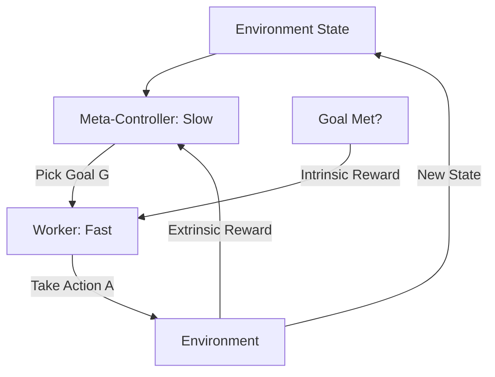

# Hierarchical DQN (h-DQN)

🧠 **What does this do? (The Analogy)**
Think of a **CEO (Meta-Controller)** and a **Manager (Worker)**. The CEO doesn't tell the Manager "Move your left hand 5 centimeters." Instead, the CEO gives a high-level goal: "Go buy a coffee." The Manager then takes over and handles all the small steps (walking, paying, opening doors) to reach that goal. **h-DQN** uses this structure to solve complex tasks that take thousands of steps.

🔍 **Step-by-Step Explanation:**
1. **Meta-Controller**: Operates at a slow time-scale. It picks a "Sub-Goal" ($g$) for the worker to achieve.
2. **Worker**: Operates at a fast time-scale. It receives the goal $g$ and takes actions $a$ to achieve it.
3. **Internal Reward**: The Worker only gets a reward if it reaches the goal set by the Meta-Controller.
4. **External Reward**: The Meta-Controller only gets a reward if the *total* mission (e.g., finishing the game) is successful.

📊 **High-Level Design (HLD)**

✅ **Why use this?**
It is the standard for **Long-Horizon Tasks**. If an agent has to find a key, open a door, and then find a treasure, standard DQN will fail because the reward is too far away. h-DQN breaks it into 3 small goals that are much easier to learn.

🌍 **Real-World Examples:**
1. **Construction Robotics**: A CEO agent decides "Build the Wall," while the Worker agent handles the precise movement of individual bricks.
2. **Complex Software Installation**: A Meta-Controller decides "Install Database," while the Worker handles the hundreds of terminal commands needed for that specific task.
