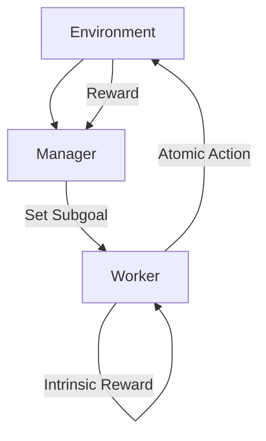

# Hierarchical Reinforcement Learning (HRL)

## Introduction
HRL breaks a complex task into multiple levels of abstraction. Usually, a **Manager** (high-level) sets goals, and a **Worker** (low-level) executes the actual actions to reach those goals.

## Core Concepts
- **Temporal Abstraction**: Thinking in terms of "Options" or sub-tasks rather than single steps.
- **Manager (Meta-Policy)**: Decides "What" to do.
- **Worker (Sub-Policy)**: Decides "How" to do it.

## High-Level Design (HLD)

## Pros and Cons
| Pros | Cons |
| :--- | :--- |
| Solves long-horizon tasks | Hard to coordinate levels |
| Reusable sub-skills | Complex state representations |
| Faster learning for complex goals | "Goal drift" between levels |

---

## Interview Questions
**Q: What is "Temporal Abstraction"?**
A: It is the ability of an agent to reason over long time scales by grouping actions into meaningful sequences (e.g., "Cook meal" instead of "Pick up knife," "Cut onion," etc.).

**Q: What is Intrinsic Reward in HRL?**
A: It is a reward the Worker gets for reaching the Subgoal set by the Manager, even if the overall environment reward hasn't been reached yet.
