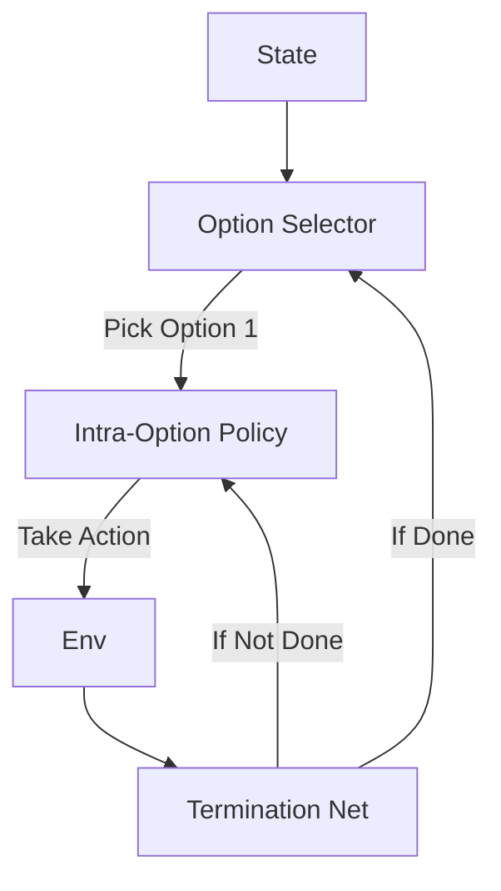

# Option-Critic Architecture (HRL)

🧠 **What does this do? (The Analogy)**
Think of a **CEO and Managers**. Standard RL is like a CEO who has to micromanage every single finger movement of every employee. **Option-Critic** allows the agent to create **Departments**. The CEO says: "Go to the Exit." The "Exit Department" (**Option**) takes over and handles the walking until the exit is reached. Crucially, the AI learns what these departments should be **on its own**, without a human telling it!

🔍 **Step-by-Step Explanation:**
1. **The Option**: A macro-action that lasts for multiple time steps (e.g., "Walk Straight").
2. **Intra-Option Policy**: The specific neural network that decides actions while an option is active.
3. **Termination Function**: A network that looks at the state and says: "Okay, the goal is reached, I'm done with this option."
4. **The Critic**: Evaluates which options are the most useful in the current situation.

📊 **High-Level Design (HLD)**

✅ **Why use this?**
It solves the "long-horizon" problem. If a task takes 10,000 steps, standard RL gets lost. Option-Critic breaks it down into 10 high-level "Options," making the problem 1,000x easier to solve.

🌍 **Real-World Examples:**
1. **Household Robots**: Learning options like "Open Door," "Pick up Plate," and "Wipe Table" that can be reused for many different chores.
2. **Gaming AI**: In open-world games, learning options like "Travel to objective," "Engage combat," and "Loot items."
