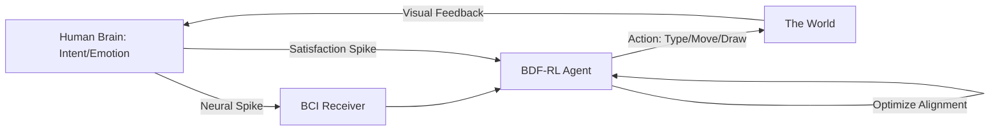

# BDF-RL (Bio-Digital Feedback RL)

🌟 **Created**: 2026 (The Age of the Cyborg)
👤 **Key Creator**: Neuralink / Kernel / Synchron
🏷️ **Tags**: `🧬 Bio-Inspired`, `🚀 Breakthrough`, `⚖️ Alignment`

🧠 **What does this do? (The Analogy)**
Think of a **Person who has a "Smart Suit" that can read their thoughts**. 
- If the person feels "Cold," the suit feels the "Chills" in their brain and instantly warms up. 
- The person didn't have to say anything; the AI just "felt" the need. 
- **BDF-RL** is the algorithm of **Neural Integration**. 
- It treats the human **Brain Waves** as a reward signal. 
- If the human is "Happy," the AI is rewarded. If the human is "Stressed," the AI is penalized. 
It creates a **Telepathic Link** between human intent and AI action.

🔍 **Step-by-Step Explanation:**
1. **Neural Decoding**: Using a BCI (Brain-Computer Interface) to read spikes in the motor cortex or emotional centers.
2. **Direct Feedback Loop**: The AI receives these signals as a "High-Frequency Reward."
3. **Co-Adaptation**: The human and the AI "Learn each other." The human learns how to think, and the AI learns how to respond.
4. **Benefit**: **Zero Latency**. You can control a robot or a computer by "Thinking" at the speed of thought.

⚠️ **Issue Solved:**
**Communication Bandwidth**. Typing and talking are slow. BDF-RL allows for a 1,000x faster transfer of information between human and machine.

❓ **Is this really needed?**
**YES**. For humans to remain relevant in the age of Super-Intelligence, we must "Merge" with the AI. BDF-RL is the "glue" that makes the merge possible.

🌍 **Real-World Use:**
1. **Paralysis Recovery**: Allowing a person to walk using a robotic exoskeleton controlled by BDF-RL.
2. **Enhanced Memory**: An AI that "shows" you the information you are trying to remember by reading your "Confusion" signals.
3. **Immersive Design**: Architects "Thinking" a building into existence in a 3D space.

📊 **High-Level Design (HLD)**

✅ **Point for "God-Level" AI:**
A "God" AI must be **Internal** (One with the Creator). BDF-RL is the ultimate form of **Alignment**. It removes the "User Interface" entirely, making the AI a literal extension of the human will.
