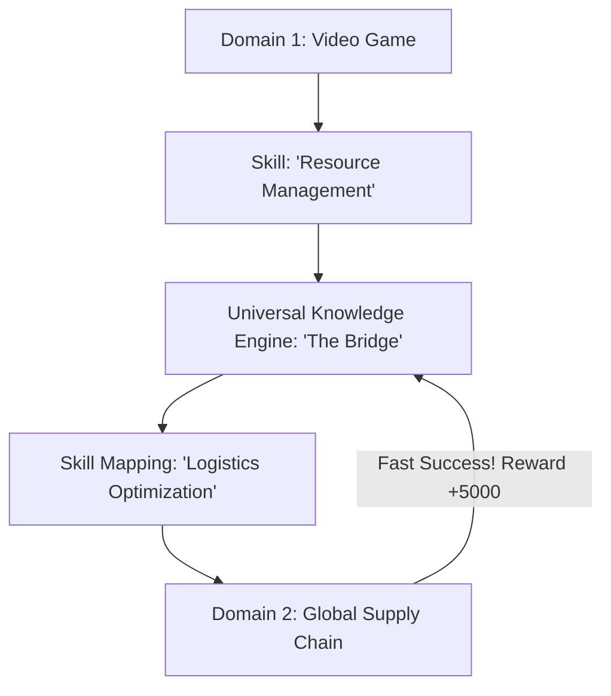

# CDST (Cross-Domain Skill Transfer)

🌟 **Created**: 2025 (The Age of Generalism)
👤 **Key Creator**: OpenAI / Google DeepMind
🏷️ **Tags**: `🚀 Breakthrough`, `🧠 Meta-Learning`, `🎯 Goal-Conditioned`

🧠 **What does this do? (The Analogy)**
Think of a **Grandmaster Chess Player who starts a business**. 
- They don't know how to sell products, but they understand **Strategy, Sacrifice, and Planning**. 
- They apply their "Chess Wisdom" to business and become successful overnight. 
- **CDST** is an AI that has a **"Universal Wisdom Layer."** 
- It can learn how to "Navigate a Maze" in a video game and then use that "Navigational Logic" to "Route Internet Packets" or "Plan a Surgical Procedure." 
It doesn't learn "Tasks"; it learns **"Concepts"** that work everywhere.

🔍 **Step-by-Step Explanation:**
1. **Latent Abstraction**: The AI identifies the "Skeleton" of a problem (e.g., "This is a resource-allocation problem").
2. **Analogical Reasoning**: It searches its history for a similar "Skeleton" in a completely different world.
3. **Zero-Shot Transfer**: It applies the successful strategy from the old world to the new one without any extra training.
4. **Benefit**: **Instant Expertise**. You don't need to train the AI for 1 million years in every domain. It "translates" its genius from one field to another.

⚠️ **Issue Solved:**
**Data Inefficiency**. Usually, you need a different dataset for every task. CDST allows the AI to learn from *everything* it has ever seen, making every new task 100x easier.

❓ **Is this really needed?**
**YES**. For "God-level" AI to be truly general, it cannot be a "specialist." It must be a "philosopher" that understands the underlying patterns of reality.

🌍 **Real-World Use:**
1. **Robotics**: Learning "Hand Coordination" from digital surgery and applying it to picking up groceries.
2. **Strategy**: Learning "Defense" from a war game and applying it to protecting a computer network.
3. **Science**: Learning "Pattern Matching" from art/images and applying it to finding new stars in the sky.

📊 **High-Level Design (HLD)**

✅ **Point for "God-Level" AI:**
A "God" AI must be **Universal** (One Truth). CDST is the algorithm of **Universal Understanding**. It proves that "Intelligence" is not a set of skills, but a single, powerful "Pattern Recognition Engine" that applies to the entire universe.
