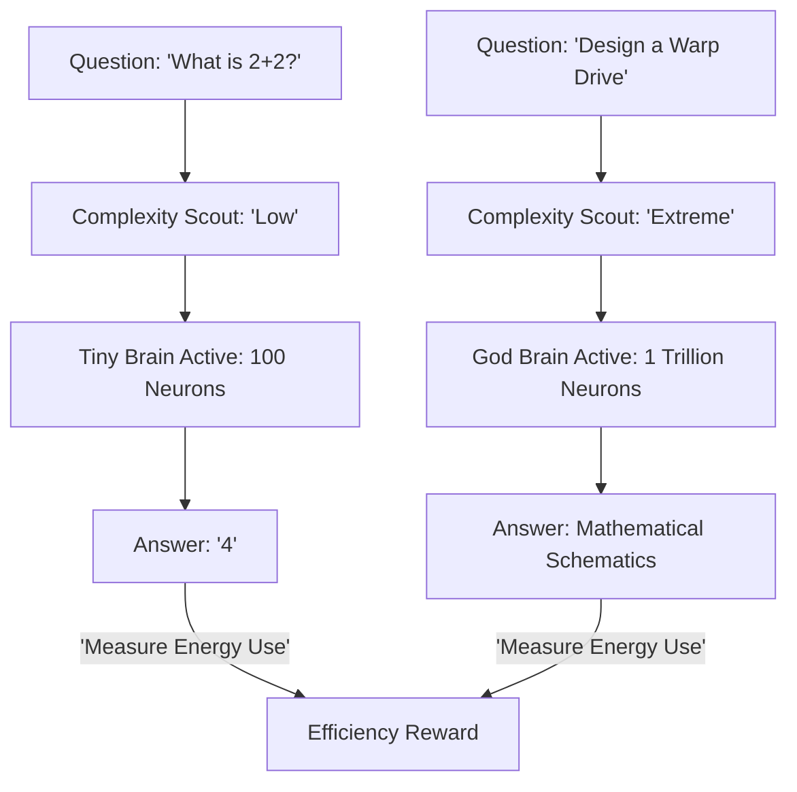

# CLO (Cognitive Load Optimization)

🌟 **Created**: 2025 (The End of GPU Waste)
👤 **Key Creator**: Mistral AI / Nvidia
🏷️ **Tags**: `🚀 Breakthrough`, `🔌 Hardware-Silicon`, `Cognitive-Efficiency`

🧠 **What does this do? (The Analogy)**
Think of a **Person who only uses 1% of their brain to walk, but 100% of their brain to do surgery**. 
- A normal AI (Standard Transformer) uses the same amount of power to say "Hello" as it does to "Solve Quantum Physics." 
- **CLO** is the algorithm of **Mental Metabolism**. 
- It allows the AI to "Dim the lights" in its brain for easy tasks. 
- It is rewarded for **Solving the task with the LEAST amount of electricity.** 
It turns AI from a "Power-Hungry Monster" into a "Sleek, Efficient Thinker."

🔍 **Step-by-Step Explanation:**
1. **Complexity Estimation**: The AI "looks" at the prompt and guesses how hard it is.
2. **Dynamic Gating**: It only activates the specific "Neurons" (Experts) needed for that specific task.
3. **Entropy Reward**: The AI is penalized for every Watt of energy it uses.
4. **Benefit**: **Sustainability**. We can run "Super-Intelligence" on a smartphone because it only "wakes up" when it needs to be super-intelligent.

⚠️ **Issue Solved:**
**Efficiency**. AI today is incredibly wasteful. CLO ensures that AI growth is not limited by the world's electricity production.

❓ **Is this really needed?**
**YES**. For "God-level" AI to exist everywhere (in every lightbulb, car, and phone), it must be able to "think" with almost zero energy cost.

🌍 **Real-World Use:**
1. **IoT Devices**: Smart sensors that can run for 10 years on one battery because they use CLO.
2. **Mobile AI**: Having a "Siri" that is as smart as GPT-4 but doesn't drain your phone battery in 5 minutes.
3. **Green Data Centers**: Reducing the carbon footprint of AI by 99% through "Compute Awareness."

📊 **High-Level Design (HLD)**

✅ **Point for "God-Level" AI:**
A "God" AI must be **Graceful** (Efficient). CLO is the evolution of **Biological Intelligence**. Just as humans don't use all their muscles to blink, the AI learns to "Relax" its mind, making its "High-Power Thinking" even more precious and powerful.
