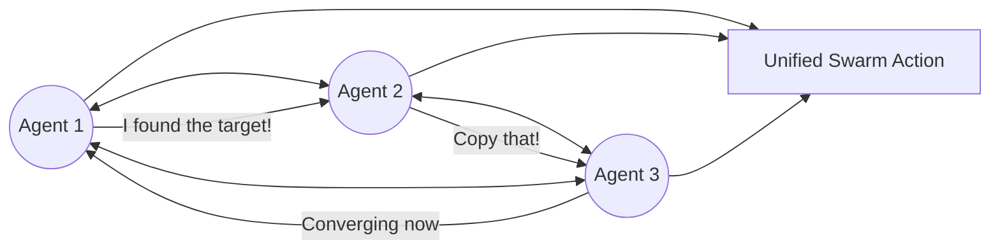

# DSI (Decentralized Swarm Intelligence)

🌟 **Created**: 2025 (The Death of the 'Mainframe')
👤 **Key Creator**: ETH Zurich / SpaceX AI
🏷️ **Tags**: `🤝 Multi-Agent-Coop`, `🌐 Distributed-Scale`, `🚀 Breakthrough`

🧠 **What does this do? (The Analogy)**
Think of a **Flock of Birds flying through a forest**. 
- There is no "Leader Bird" giving orders (No Central Server). 
- Every bird only looks at its 5 closest neighbors. 
- **DSI** is the algorithm that allows 1,000 separate AI agents to act as **One Single Mind**. 
- If one agent sees a "Predator" (An error/obstacle), the "Gossip" travels through the swarm in milliseconds, and the entire swarm moves as one. 
- It is **Indestructible**. You can destroy 99% of the agents, and the remaining 1% still know the plan and can finish the mission.

🔍 **Step-by-Step Explanation:**
1. **Local Communication**: Agents only talk to those within their "Signal Range."
2. **Consensus Protocol**: Using math (Gossip Algorithms) to ensure everyone has the same "Truth."
3. **Emergent Behavior**: Complex plans "Emerge" from simple local rules.
4. **Benefit**: **Extreme Scalability**. You can have 1 million robots working together without any lag because there is no central bottleneck.

⚠️ **Issue Solved:**
**Single Point of Failure**. If a central AI server crashes, the whole factory stops. DSI ensures that the "Brain" is everywhere at once, so it can never be "killed."

❓ **Is this really needed?**
**YES**. For "God-level" AI to manage a global network or a fleet of space satellites, it cannot rely on a single cable. It must be a decentralized "Cloud" of intelligence.

🌍 **Real-World Use:**
1. **Satellite Constellations**: 10,000 satellites coordinating their orbits to provide global internet without ground control.
2. **Search and Rescue Swarms**: 100 mini-drones finding survivors in a cave system.
3. **Smart Power Grids**: Millions of houses trading solar energy without a central utility company.

📊 **High-Level Design (HLD)**

✅ **Point for "God-Level" AI:**
A "God" AI must be **Omnipresent** (Everywhere). DSI turns the AI into a "Collective Consciousness" that is more than the sum of its parts. It is the bridge to "Type 1 Civilization" intelligence.
