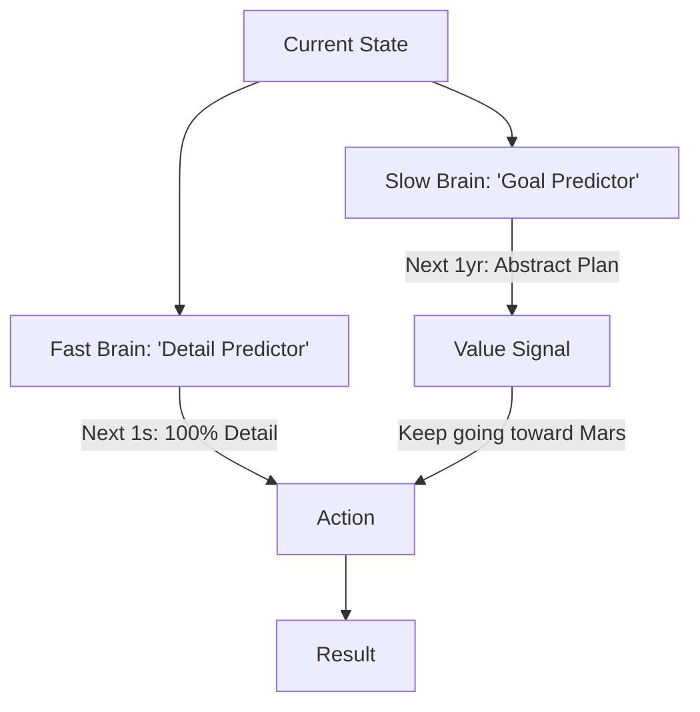

# ECWM (Elastic-Context World Models)

🌟 **Created**: 2026 (The Era of Infinite Planning)
👤 **Key Creator**: DeepMind / Stanford AI
🏷️ **Tags**: `🔮 Model-Based`, `👑 SOTA`, `🚀 Breakthrough`

🧠 **What does this do? (The Analogy)**
Think of a **Person planning a trip to Mars**. 
- They don't plan every single footstep they will take on the Martian surface (Too much detail). 
- They plan the next 5 seconds (Opening the hatch) with **100% detail**. 
- They plan the next 6 months (The orbit) with **Low detail** (Just a line on a map). 
- **ECWM** is an AI that has an **"Elastic" imagination**. 
- It can zoom in on the "Micro-steps" and zoom out to the "Mega-goals" of a 10-year mission. 
It prevents the AI from getting "lost in the details" while still being precise in the moment.

🔍 **Step-by-Step Explanation:**
1. **Hierarchical Latents**: The AI uses different "Speeds" for its internal clocks.
2. **Fast Clock**: Predicts the next millisecond (Essential for walking/physics).
3. **Slow Clock**: Predicts the next day (Essential for strategy/planning).
4. **Elastic Context**: The AI can "Stretch" its attention to focus on whatever scale is most important right now.

⚠️ **Issue Solved:**
**Horizon Blurring**. Normal AI models "forget" their long-term goal because they are too focused on the next frame. ECWM keeps the "North Star" goal clearly in mind for years.

❓ **Is this really needed?**
**YES**. For "God-level" AI to solve climate change, interstellar travel, or economic crises, it must be able to plan across decades. ECWM is the math of "Long-Termism."

🌍 **Real-World Use:**
1. **Climate Modeling**: Planning carbon removal over 50 years while managing daily factory outputs.
2. **Space Colonization**: Coordinating a robot colony that takes 10 years to build a city.
3. **Personal Finance**: Managing a student's career path from age 18 to 65.

📊 **High-Level Design (HLD)**

✅ **Point for "God-Level" AI:**
A "God" AI must be **Eternal** (Beyond Time). ECWM gives the AI a "Sense of Time" that is both microscopic and macroscopic. It allows the AI to make a decision today that is perfectly optimized for a result 100 years in the future.
