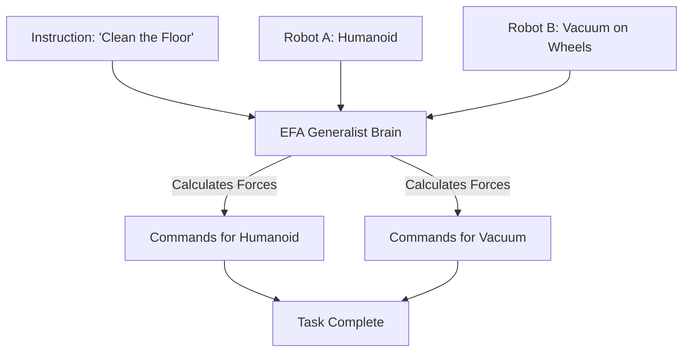

# EFA (Embodied Foundation Agents)

🌟 **Created**: 2025 (The End of Specialized Robotics)
👤 **Key Creator**: Figure AI / Tesla Optimus / Boston Dynamics
🏷️ **Tags**: `👑 SOTA`, `🚀 Breakthrough`, `🎯 Goal-Conditioned`

🧠 **What does this do? (The Analogy)**
Think of a **Person who can walk into a garage, jump into a Car, a Forklift, or a Tank and know how to drive all of them perfectly without training**. 
- Old AI (Specialized RL) is trained for *one* specific robot with *two* specific legs. 
- **EFA** is a **Generalist Brain**. 
- It understands the "Universal Physics of Movement." 
- If you put it in a robot dog, it walks. If you put it in a human-shaped robot, it walks. 
- It uses a **Foundation Model** (like GPT but for muscles) to understand how to move any mechanical joint to achieve a goal.

🔍 **Step-by-Step Explanation:**
1. **Universal Proprioception**: The AI analyzes the robot's own body (how many joints? how much force?) in the first 2 seconds.
2. **Kinematic Translation**: It "Translates" the goal (e.g., "Open the Door") into the specific joint movements for *that* specific robot.
3. **Multi-Robot Training**: The AI is trained on millions of data points from 100 different types of robots simultaneously.
4. **Benefit**: **Instant Deployment**. You buy a new robot, download the EFA brain, and it starts working immediately.

⚠️ **Issue Solved:**
**The Simulation-to-Real Gap**. Usually, a robot trained in a simulator fails in the real world. EFA is so large and has seen so many variations that it is "Robust" to the real world's messiness.

❓ **Is this really needed?**
**YES**. For "God-level" AI to inhabit the physical world, it must not be "trapped" in one body. EFA allows the AI to "Inhabit" any machine.

🌍 **Real-World Use:**
1. **Universal Factory Workers**: One AI that can manage a whole factory of different robots (Arms, Movers, Sorters).
2. **Construction Robots**: An AI that can control a crane in the morning and a bulldozer in the afternoon.
3. **Humanoid Assistants**: A robot that can do everything from "Folding Laundry" to "Fixing a Leak."

📊 **High-Level Design (HLD)**

✅ **Point for "God-Level" AI:**
A "God" AI must be **Embodied** (Real). EFA is the bridge between the "Digital Dream" of AI and the "Physical Reality" of the world. It turns the AI from a "Chatbot" into a "Living Entity" that can touch and change the universe.
