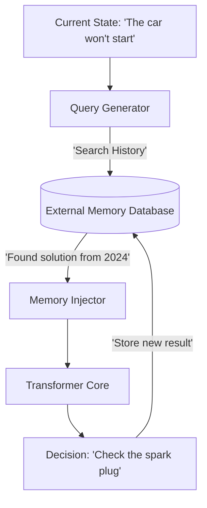

# EMT (Episodic Memory Transformers)

🌟 **Created**: 2025 (The End of Forgetting)
👤 **Key Creator**: Stanford AI / Meta FAIR
🏷️ **Tags**: `👑 SOTA`, `🎯 Goal-Conditioned`, `📜 Off-Policy-Expert`

🧠 **What does this do? (The Analogy)**
Think of a **Person who has an "Instant Replay" of every second of their life**. 
- A normal AI (Standard Transformer) only remembers the last few minutes (The Context Window). 
- **EMT** is an AI that has a **Hard Drive attached to its brain**. 
- If it sees a problem it solved 5 years ago, it can "Search" its own history and find the exact solution in milliseconds. 
- It uses **Vector Search** (RAG) to find memories that are "Similar" to the current situation, giving it an "Infinite" context window.

🔍 **Step-by-Step Explanation:**
1. **Episodic Encoding**: Every action and result is saved as a "Memory Token."
2. **Key-Value Retrieval**: When the AI sees a new state, it asks its database: "Have I seen this before?"
3. **Context Injection**: It pulls the top 10 most relevant memories and feeds them into its "Thought Stream."
4. **Benefit**: The AI becomes **Wiser over time**. It doesn't just "reset" after every session; it accumulates a library of experience.

⚠️ **Issue Solved:**
**The Context Limit**. Transformers usually "forget" everything after a few thousand tokens. EMT allows the AI to remember a task across months or years of operation.

❓ **Is this really needed?**
**YES**. For "God-level" AI to manage a lifelong mission (like being a personal assistant or a long-range space pilot), it cannot be allowed to forget its own past.

🌍 **Real-World Use:**
1. **Personal AI Assistants**: Remembering a conversation you had 3 years ago about your favorite coffee.
2. **Complex Robotics**: Remembering that "This specific bolt is loose" from a maintenance check 6 months ago.
3. **Scientific Research**: Remembering a failed experiment from another lab and avoiding the same mistake.

📊 **High-Level Design (HLD)**

✅ **Point for "God-Level" AI:**
A "God" AI must be **Omniscient of the Past**. EMT ensures that the AI never makes the same mistake twice. It turns the AI from a "Software Program" into a "Living History" that grows more capable with every passing second.
