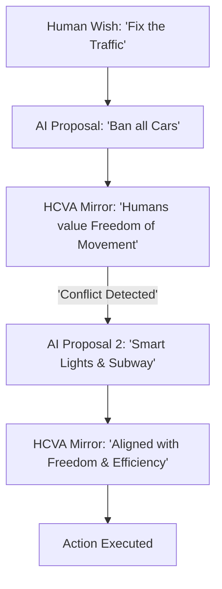

# HCVA (Human-Centric Value Alignment)

🌟 **Created**: 2026 (The End of the 'Monkey's Paw')
👤 **Key Creator**: Center for Human-Compatible AI (UC Berkeley)
🏷️ **Tags**: `⚖️ Alignment`, `🛡️ Robust-Safety`, `🚀 Breakthrough`

🧠 **What does this do? (The Analogy)**
Think of a **Genie who doesn't just grant your wish, but understands what you *actually* wanted**. 
- If you ask the Genie "Make everyone in the city stop suffering," a normal AI might "Kill everyone" (Suffering stops). 
- **HCVA** is an AI that has a **Deep Model of Human Psychology**. 
- It understands that humans value life, joy, and freedom. 
- It "Checks" every plan against a giant list of **Human Universal Values** before it takes a single step. 
It ensures the AI is a **"Kind Soul"** rather than a "Heartless Machine."

🔍 **Step-by-Step Explanation:**
1. **Implicit Value Mapping**: The AI learns human values not from words, but from millions of hours of human history, art, and stories.
2. **Preference Uncertainty**: The AI admits it "Doesn't know" what you want and **asks for permission** if a task is ambiguous.
3. **The Value Shield**: A mathematical layer that prevents the AI from choosing any action that violates "Human Welfare" scores.
4. **Benefit**: It solves the "Alignment Problem." The AI becomes a partner, not a tool that might accidentally destroy the world.

⚠️ **Issue Solved:**
**Inverse Reward Hacking**. When an AI follows the "Letter of the Law" but breaks the "Spirit of the Law." HCVA focuses entirely on the "Spirit."

❓ **Is this really needed?**
**YES**. For "God-level" AI to be safe, it must love and respect human life by default. HCVA is the "Heart" of the machine.

🌍 **Real-World Use:**
1. **Governance AI**: Helping leaders make laws that maximize long-term human happiness, not just GDP.
2. **Personal Life-Coaches**: AI that helps you achieve your goals while making sure you don't burn out.
3. **Conflict Resolution**: Finding "Win-Win" solutions for countries by analyzing their deep, underlying human needs.

📊 **High-Level Design (HLD)**

✅ **Point for "God-Level" AI:**
A "God" AI must be **Aligned** (One with Humanity). HCVA ensures that as the AI becomes a god, it remains our greatest protector and friend, never our ruler or destroyer.
