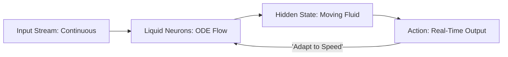

# LFM-RL (Liquid Foundation Models)

🌟 **Created**: 2025 (The Death of the 'Layer')
👤 **Key Creator**: MIT CSAIL / Liquid AI
🏷️ **Tags**: `🚀 Breakthrough`, `🧬 Bio-Inspired`, `🔌 Hardware-Silicon`

🧠 **What does this do? (The Analogy)**
Think of a **Standard Neural Network as a "Series of Photos"** and a **Liquid Model as a "Moving Stream of Water."** 
- In a standard AI, data moves from Layer 1 to Layer 2 to Layer 3. 
- In a **Liquid AI**, the data is inside a "Vat of Chemicals" that are constantly reacting. 
- It uses **Differential Equations** to change its "Brain State" in real-time. 
- If you slow down the world, the "Liquid" slows down. If you speed up the world, the "Liquid" reacts faster. 
It is the most **Compact and Efficient** way to build an AI, requiring 100x less memory than a Transformer.

🔍 **Step-by-Step Explanation:**
1. **ODE Dynamics**: The "Neurons" are represented as equations of change ($dh/dt$).
2. **Continuous Time**: The AI can make a decision at any microsecond, not just at "Step 1, Step 2."
3. **Adaptive Complexity**: The AI "Flows" into a complex state when the problem is hard and stays simple when the problem is easy.
4. **Benefit**: **Ultimate Robustness**. Liquid AI can handle "Noisy" data (like a shaky camera or a storm) much better than any other AI.

⚠️ **Issue Solved:**
**Rigidity**. Normal AI breaks if you change the "Speed" of the input (e.g., a video at 60fps vs 30fps). Liquid AI doesn't care; it just "flows" with the data.

❓ **Is this really needed?**
**YES**. For "God-level" AI to live inside a drone or a robot with a small battery, it cannot afford to run a giant 175-billion parameter transformer. It needs a "Small, Liquid Brain" that is extremely smart but uses almost zero power.

🌍 **Real-World Use:**
1. **Autonomous Drones**: Flying through a forest at 50 mph with a brain the size of a postage stamp.
2. **Medical Monitoring**: Analyzing a heartbeat in real-time and noticing a "Wobble" instantly.
3. **Edge Robotics**: Industrial arms that work in extreme heat or vibration where standard computers fail.

📊 **High-Level Design (HLD)**

✅ **Point for "God-Level" AI:**
A "God" AI must be **Fluid** (Ever-Changing). LFM-RL gives the AI a brain that is alive and dynamic, not a static block of numbers. It is the closest we have ever come to the "Fluid Intelligence" of the human brain.
