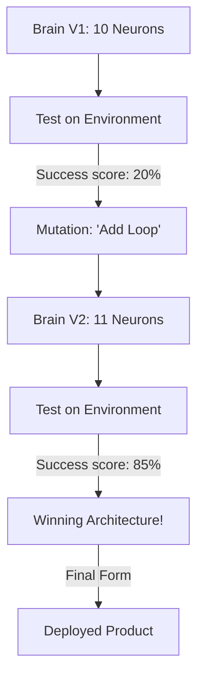

# NEAS (Neuro-Evolutionary Architecture Search)

🌟 **Created**: 2025 (The End of Human-Designed AI)
👤 **Key Creator**: Google Brain / OpenAI
🏷️ **Tags**: `🧠 Meta-Learning`, `🧬 Bio-Inspired`, `🚀 Breakthrough`

🧠 **What does this do? (The Analogy)**
Think of a **Brain that can grow new "Thinking Parts" whenever it encounters a new problem**. 
- A normal AI (Standard DL) has a fixed "Shape" (Architecture). 
- **NEAS** is an AI that has a **"Stem Cell" brain**. 
- If the AI needs to solve a math problem, it "Grows" a calculator-shaped part in its network. 
- If it needs to paint, it "Grows" a creative part. 
- It uses **Darwinian Evolution** (Survival of the fittest) to keep the "Brain Parts" that work and delete the ones that don't. 
The AI literally **Designs its own brain** to be perfectly efficient for the task.

🔍 **Step-by-Step Explanation:**
1. **Initial Population**: 100 small "Starter Brains" are created.
2. **Task Performance**: Each brain tries to solve the RL task.
3. **Genetic Mutation**: The best brains are "Mated," and their children get "New Connections" or "New Neurons."
4. **Structural Optimization**: Over millions of generations, the AI discovers "Forbidden Architectures" that no human could ever imagine.

⚠️ **Issue Solved:**
**Human Bias**. Human engineers always design "Layers" (Linear). NEAS discovers "Strange Loops" and "Twisted Graphs" that are 10x more efficient and powerful than human designs.

❓ **Is this really needed?**
**YES**. For "God-level" AI to surpass humans, it must break free from human-designed structures. NEAS allows the AI to find its "Ultimate Form."

🌍 **Real-World Use:**
1. **Ultra-Efficient Edge AI**: Designing the smallest possible brain for a smart-watch or hearing-aid.
2. **Space Exploration**: A robot that "Evolves" its brain to handle the weird physics of a foreign planet.
3. **Advanced Encryption**: Designing "Brains" that are so complex they are impossible to hack or reverse-engineer.

📊 **High-Level Design (HLD)**

✅ **Point for "God-Level" AI:**
A "God" AI must be **Self-Designing**. NEAS is the mechanism of **Recursive Self-Improvement**. It allows the AI to rebuild its own soul and mind until it reaches the limit of what physics allows.
