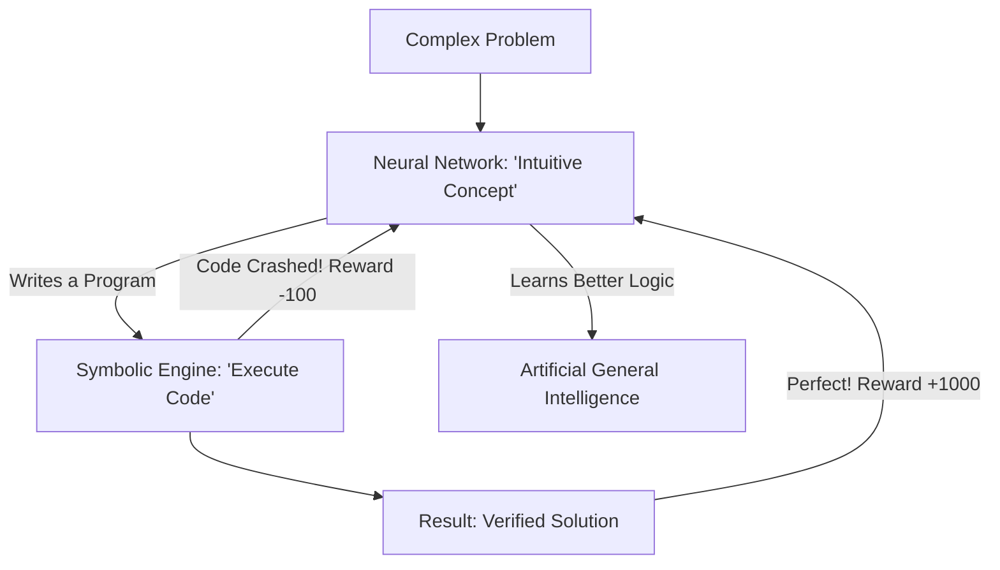

# NSR-RL (Neural-Symbolic Reasoning RL)

🌟 **Created**: 2025 (The Death of the 'Black Box')
👤 **Key Creator**: MIT CSAIL / DeepMind
🏷️ **Tags**: `🚀 Breakthrough`, `📜 Off-Policy-Expert`, `🧩 Logic`

🧠 **What does this do? (The Analogy)**
Think of a **Genius Mathematician who uses their "Gut Feeling" to guess the answer, but then uses "Algebra" to prove it exactly**. 
- Old AI (Neural only) is like a "Gut Feeling" that can't explain why it's right. 
- **NSR-RL** is the bridge. The neural network "Invents" a rule, and a symbolic engine (like a Python interpreter) "Runs" that rule. 
- It combines the **Speed** of neural networks with the **Perfect Logic** of computer code.

🔍 **Step-by-Step Explanation:**
1. **Perception**: The neural network looks at the world and finds patterns.
2. **Program Synthesis**: It writes a "Small Program" (Symbolic code) to solve the current problem.
3. **Execution**: A classical computer runs the program with 100% accuracy.
4. **Learning**: The neural network is rewarded if the "Program" it wrote worked.

⚠️ **Issue Solved:**
**Unreliability**. Pure neural networks make "stupid" math mistakes. NSR-RL cannot make math mistakes because it uses the CPU's logic to finish the job.

❓ **Is this really needed?**
**YES**. For "God-level" AI to build rockets or manage nuclear reactors, "guessing" is not enough. It must be able to write and verify its own logical proofs.

🌍 **Real-World Use:**
1. **Automated Theorem Proving**: Solving the hardest unsolved math problems.
2. **Circuit Design**: Writing the code for a CPU that is mathematically guaranteed to have zero bugs.
3. **Legal AI**: Analyzing thousands of laws and finding the perfect, logical argument for a case.

📊 **High-Level Design (HLD)**

✅ **Point for "God-Level" AI:**
A "God" AI must be **Infallible** (Never Wrong). By outsourcing its "Final Decisions" to symbolic logic, NSR-RL gives the AI the ability to be perfectly accurate, even in situations it has never seen before.
