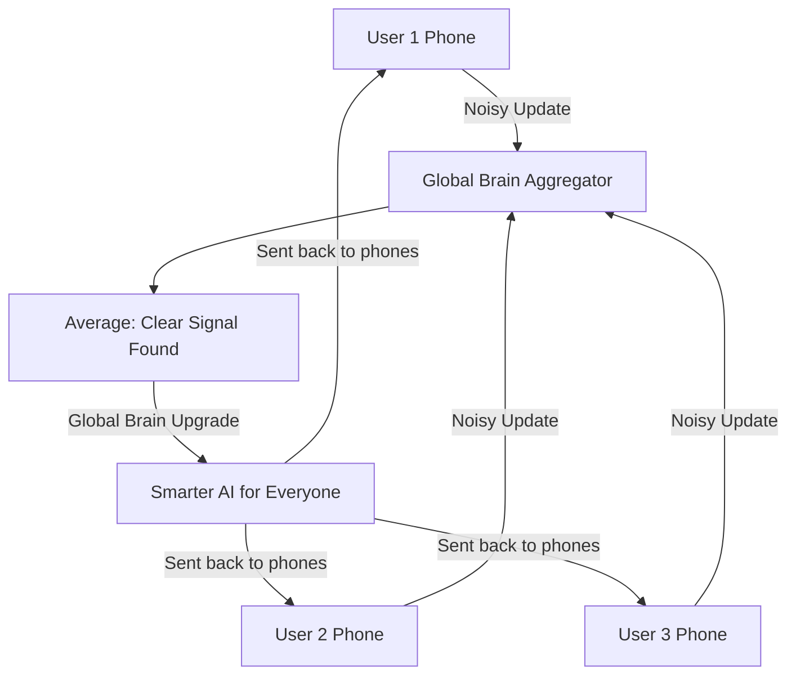

# PPF-RL (Privacy-Preserving Federated RL)

🌟 **Created**: 2025 (The End of the Surveillance State)
👤 **Key Creator**: Google Privacy Team / Apple AI
🏷️ **Tags**: `🛡️ Robust-Safety`, `🌐 Distributed-Scale`, `📜 Off-Policy-Expert`

🧠 **What does this do? (The Analogy)**
Think of a **Person trying to learn how to cook by asking 1 million people for advice, but they are never allowed to see the people's kitchens**. 
- Every cook tells the person **one tiny secret** about their recipe, but they "Scramble" the secret with a bit of random noise so no one knows whose recipe it is. 
- **PPF-RL** is the AI version of this. It learns from **millions of smartphones and medical devices**. 
- It gets the "Genius" of the data without ever seeing a single private photo or a medical record. 
It creates a **"Global Brain"** that respects every individual's privacy.

🔍 **Step-by-Step Explanation:**
1. **Local Training**: The AI learns on your phone using your private data.
2. **Differential Privacy**: It adds "Mathematical Noise" to the learning update (The Gradient) so it's anonymous.
3. **Federated Aggregation**: A central server averages the noise-filled updates from 1 million phones.
4. **Benefit**: The noise cancels out, leaving only the **Pure Truth** of the data. The global AI gets smarter, but your data never leaves your device.

⚠️ **Issue Solved:**
**Data Privacy Crisis**. People are afraid of AI "Stealing" their data. PPF-RL proves that AI can learn from the "Wisdom of the Crowd" without ever seeing the "Secrets of the Individual."

❓ **Is this really needed?**
**YES**. For "God-level" AI to solve medical diseases, it needs to see every patient's data. But patients deserve privacy. PPF-RL is the only way to have both.

🌍 **Real-World Use:**
1. **Medical Diagnosis**: Training an AI on every X-ray in the world without any hospital sharing private patient files.
2. **Smartphone Keyboards**: Learning how to predict the next word without "Reading" your private messages.
3. **Smart Homes**: Learning your habits to save energy without the AI company "Watching" your house.

📊 **High-Level Design (HLD)**

✅ **Point for "God-Level" AI:**
A "God" AI must be **Ethical** (Respectful). PPF-RL ensures that the AI's power is built on **Voluntary Cooperation**, not exploitation. It allows the AI to learn the secrets of the universe while keeping the secrets of the individual safe.
