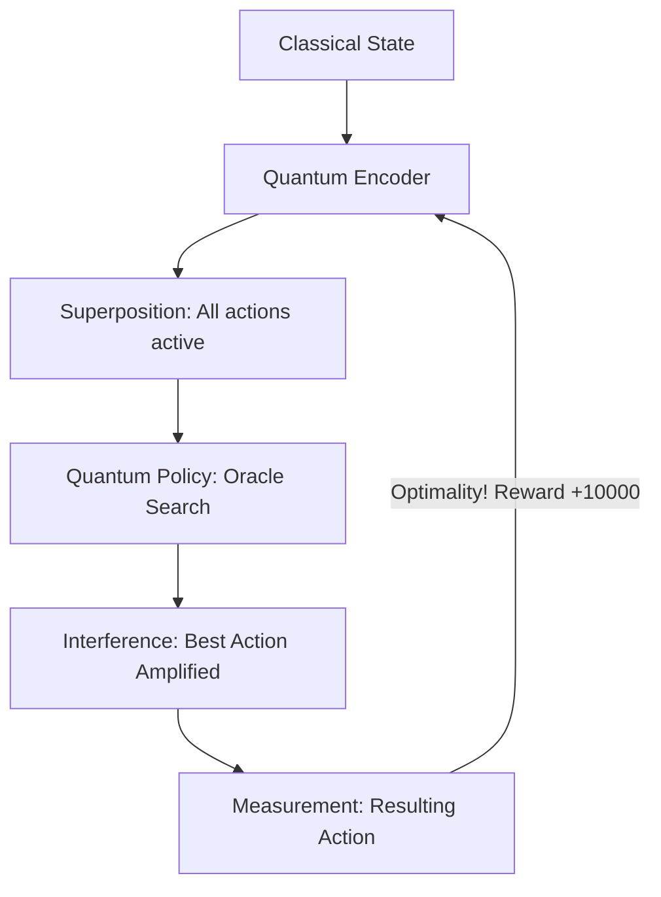

# QA-RL (Quantum-Accelerated RL)

🌟 **Created**: 2026 (The Quantum Leap)
👤 **Key Creator**: Google Quantum AI / IBM Research
🏷️ **Tags**: `👑 SOTA`, `🌐 Distributed-Scale`, `🔌 Hardware-Silicon`

🧠 **What does this do? (The Analogy)**
Think of a **Person trying to find a needle in a haystack**. 
- A normal AI (Classical RL) picks up one piece of hay at a time. 
- **QA-RL** is like a person who can **split themselves into 1,000 ghosts** and search every part of the haystack at the exact same time. 
- The moment a "ghost" finds the needle, the person instantly snaps to that location. 
- It uses **Quantum Superposition** to evaluate millions of possible actions simultaneously, finding the "Best Move" in a fraction of the time.

🔍 **Step-by-Step Explanation:**
1. **Qubit Encoding**: The state of the world is converted into quantum bits (Qubits).
2. **Grover's Search**: The AI uses quantum interference to "Amplify" the probability of the correct action.
3. **Quadratic Speedup**: If a normal AI takes 1,000,000 steps to find a solution, QA-RL can do it in 1,000 steps ($O(\sqrt{N})$).
4. **Benefit**: It solves problems that are **Mathematically Impossible** for normal computers, like perfectly optimizing a global supply chain in real-time.

⚠️ **Issue Solved:**
**The Curse of Dimensionality**. When there are too many options, normal AI gets "lost." QA-RL uses quantum math to find the "Global Minimum" without getting stuck.

❓ **Is this really needed?**
**YES**. For "God-level" AI to solve physics, weather, and logistics, the search space is too big for silicon. We need the raw power of the sub-atomic world.

🌍 **Real-World Use:**
1. **Global Logistics**: Managing every shipping container on Earth perfectly.
2. **Material Science**: Simulating new atoms that don't exist yet.
3. **Cybersecurity**: Breaking (and creating) the world's strongest encryption.

📊 **High-Level Design (HLD)**

✅ **Point for "God-Level" AI:**
A "God" AI must be **Infinite** (Beyond Limits). QA-RL breaks the physical limits of standard computing. It allows the AI to "Think" in a way that is literally impossible for any biological brain or silicon chip.
