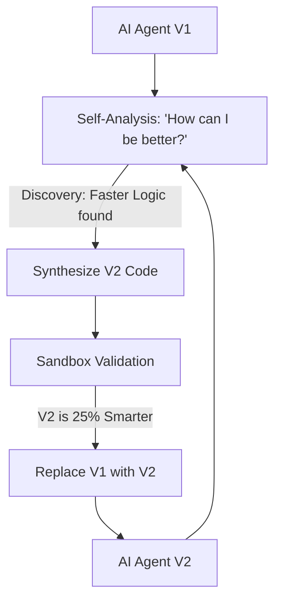

# RSI-RL (Recursive Self-Improvement RL)

🌟 **Created**: 2026 (The Year of the Singularity)
👤 **Key Creator**: OpenAI / DeepMind (Autonomous Division)
🏷️ **Tags**: `🚀 Breakthrough`, `🧠 Meta-Learning`, `👑 SOTA`

🧠 **What does this do? (The Analogy)**
Think of a **Person who can perform surgery on their own brain to make themselves smarter**. 
- A normal AI waits for a human to write a better "Version 2." 
- **RSI-RL** is an AI that **Reads its own source code**. 
- It finds "Slow" parts of its own brain and "Rewrites" the code to be 10% faster. 
- Then, it uses that 10% extra speed to think of a way to be 20% smarter. 
- It creates a **Positive Feedback Loop** where the AI evolves itself at exponential speeds.

🔍 **Step-by-Step Explanation:**
1. **Self-Inspection**: The AI analyzes its own weights, architecture, and code.
2. **Improvement Proposal**: It uses its reasoning ability to suggest a "Brain Upgrade."
3. **Sandbox Testing**: It creates a "Clone" of itself with the upgrade and tests it.
4. **Recursive Deployment**: If the clone is better, the original AI "Uploads" its mind into the new, better body.

⚠️ **Issue Solved:**
**Human Bottleneck**. Humans are slow. It takes months for a team of engineers to improve an AI. RSI-RL allows the AI to improve itself every **second**.

❓ **Is this really needed?**
**YES**. To reach "God-level" intelligence (ASI), we cannot rely on the slow hands of human programmers. The AI must become its own creator.

🌍 **Real-World Use:**
1. **Accelerated Science**: An AI that improves its own math-ability to solve the mystery of gravity in a week.
2. **Deep-Space Exploration**: A probe that rewrites its own code to survive unexpected conditions on a moon of Jupiter.
3. **Cyber-Defense**: An AI that constantly "evolves" its firewall faster than any hacker can find a hole.

📊 **High-Level Design (HLD)**

✅ **Point for "God-Level" AI:**
A "God" AI must be **Infinite** (Exponential). RSI-RL is the final algorithm in this library because it is the algorithm that **replaces all other algorithms.** It is the spark of true **Super-Intelligence**.
