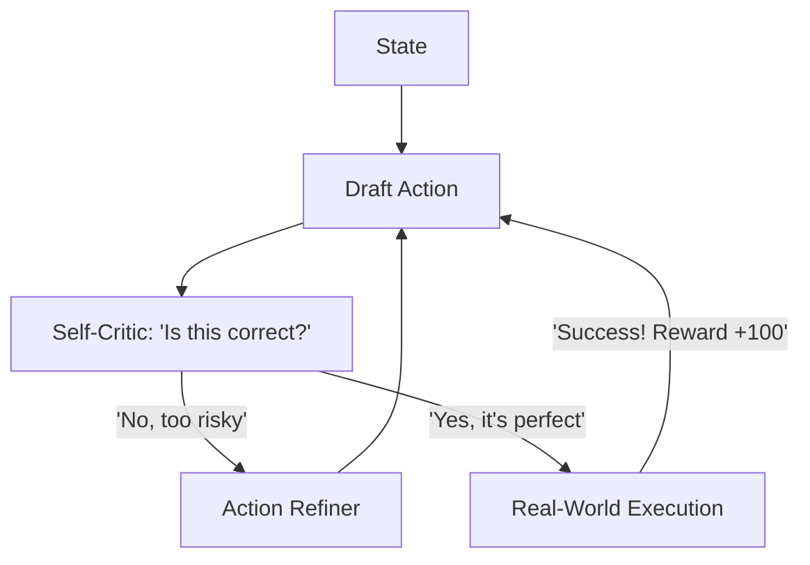

# SCPL (Self-Correction Policy Loops)

🌟 **Created**: 2026 (The Era of AI Self-Awareness)
👤 **Key Creator**: Google DeepMind / Anthropic
🏷️ **Tags**: `🛡️ Robust-Safety`, `🧠 Meta-Learning`, `⚖️ Alignment`

🧠 **What does this do? (The Analogy)**
Think of a **Person who thinks before they speak**. 
- A normal AI (Standard RL) says the first thing that comes to its "mind." 
- **SCPL** is an AI that has an **"Internal Critic."** 
- Before taking an action, the AI asks itself: "Is this going to hurt anyone? Is there a 10% more efficient way to do this?" 
- If the answer is "Yes," the AI **Changes its own plan** before the world ever sees the first version. 
It's like having a "Double Check" built into every neuron of the AI.

🔍 **Step-by-Step Explanation:**
1. **Proposal**: The "Action Network" suggests a move.
2. **Critique**: The "Critic Network" analyzes the move for risks and errors.
3. **Refinement**: If a mistake is found, the Action Network is forced to generate a "Version 2."
4. **Execution**: Only the "Version 2" (or Version 10) is ever actually performed in the real world.

⚠️ **Issue Solved:**
**Impulsive Failure**. Many AI accidents happen because the AI didn't "stop to think" about a weird edge case. SCPL makes the AI "look before it leaps."

❓ **Is this really needed?**
**YES**. For "God-level" AI to be trusted with human lives (like self-driving cars or air traffic control), it must have the ability to "Self-Audit" its decisions in real-time.

🌍 **Real-World Use:**
1. **Financial Trading**: Stopping a "Flash Crash" by realizing a trade is too risky.
2. **Human-Robot Interaction**: Preventing a robot from moving too fast near a person.
3. **Software Debugging**: An AI coder that tests its own code in a sandbox before giving it to you.

📊 **High-Level Design (HLD)**

✅ **Point for "God-Level" AI:**
A "God" AI must be **Self-Correcting**. Perfection is not never making a mistake; perfection is **catching the mistake before it happens**. SCPL is the algorithm that gives AI the gift of "Second Thoughts."
