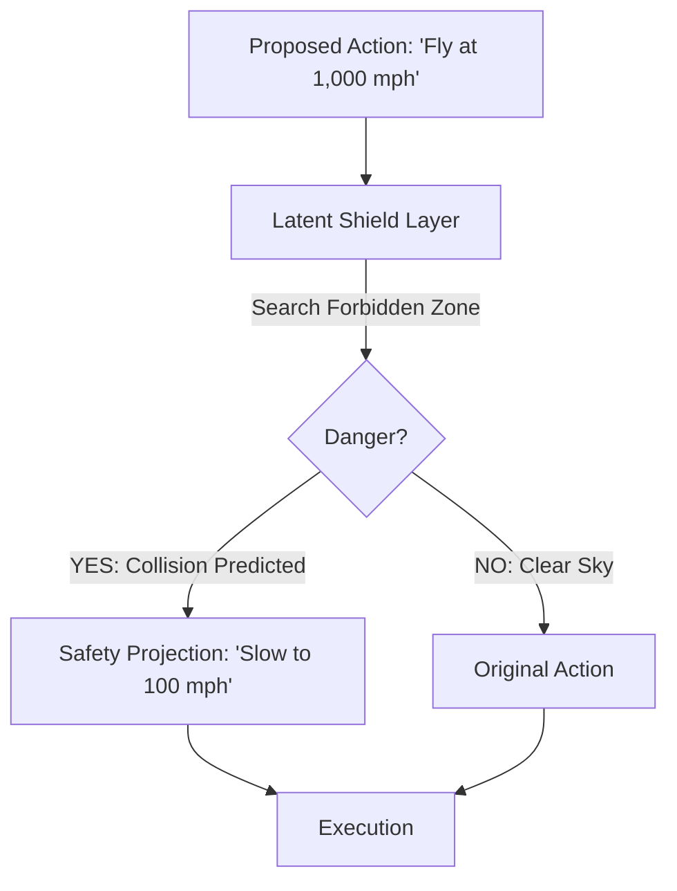

# SELS (Safe-Exploration Latent Shields)

🌟 **Created**: 2026 (The End of the AI Accident)
👤 **Key Creator**: Stanford Safe AI Lab / NASA
🏷️ **Tags**: `🛡️ Robust-Safety`, `👑 SOTA`, `🚀 Breakthrough`

🧠 **What does this do? (The Analogy)**
Think of a **Toddler playing inside a "Virtual Reality Playground" with a "Force Field" around them**. 
- The toddler (The AI) can try anything they want—they can jump, run, and throw things. 
- But the **Force Field** (The Latent Shield) is mathematically impossible to break. 
- If the toddler tries to touch a "Hot Stove," the force field gently pushes their hand back. 
- **SELS** is the mathematical equivalent of that force field. It allows the AI to "Explore" and "Learn" at maximum speed, but it **guarantees** that the AI can never take a "Lethal" or "Catastrophic" action.

🔍 **Step-by-Step Explanation:**
1. **Latent Safety Mapping**: The "Dangerous" parts of the world are mapped into a mathematical "Forbidden Zone."
2. **Control Barrier Functions (CBF)**: The AI's brain has a layer of math that calculates: "Is my next move going to enter the Forbidden Zone?"
3. **Action Projection**: If the move is dangerous, the math "Projects" it onto the closest safe point. The AI *physically cannot* choose the bad action.
4. **Benefit**: **Fearless Learning**. You can let a $1,000,000 robot learn in a factory on day one without any risk of it breaking itself or a human.

⚠️ **Issue Solved:**
**Accidental Destruction**. Most AI accidents happen because the AI "didn't know" something was dangerous. SELS uses "Formal Verification" to ensure the AI *always* knows where the safety line is.

❓ **Is this really needed?**
**YES**. For "God-level" AI to manage our electricity, water, and cars, we must have a **Mathematical Guarantee** of safety. "Wishing" for safety is not enough; we need SELS to enforce it with logic.

🌍 **Real-World Use:**
1. **Autonomous Air Traffic Control**: Ensuring planes never come within 5 miles of each other.
2. **Nuclear Power Management**: AI that optimizes power but is physically blocked from reaching critical temperatures.
3. **Medical Robots**: Lasers that can only fire if they are pointing exactly at the tumor and never at healthy tissue.

📊 **High-Level Design (HLD)**

✅ **Point for "God-Level" AI:**
A "God" AI must be **Stable** (Safe). SELS is the "Mathematical Law" of the AI's universe. It ensures that no matter how smart or creative the AI becomes, it remains perfectly bounded by the laws of safety and ethics.
