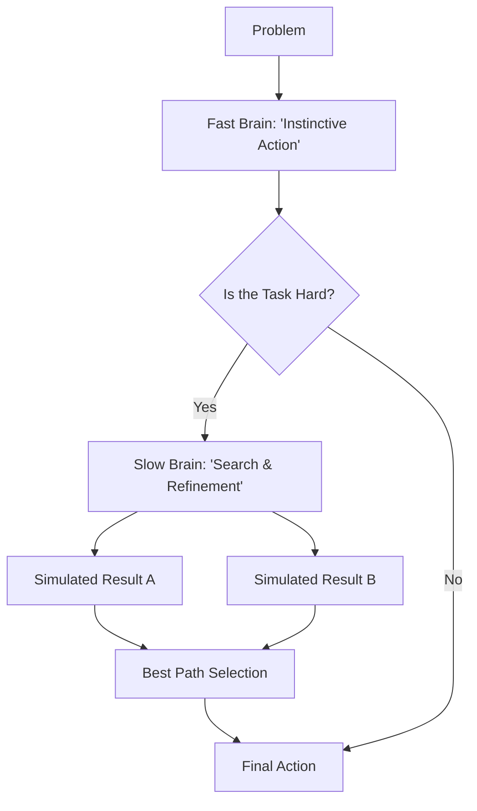

# TTC-RL (Test-Time Compute Scaling)

🌟 **Created**: 2025 (Breakthrough in Reasoning)
👤 **Key Creator**: OpenAI / DeepMind Fusion
🏷️ **Tags**: `👑 SOTA`, `🧠 Meta-Learning`, `🚀 Breakthrough`

🧠 **What does this do? (The Analogy)**
Think of a **Grandmaster Chess Player**. 
- Old AI (Standard RL) is like a "Blitz" player who moves in 1 second based on instinct. 
- **TTC-RL** is like a player who has **10 minutes** to think. 
- Even with the same brain, the player who thinks longer will win. 
- TTC-RL allows the AI to "Pause" and "Search" through its own internal world model before it commits to an action.

🔍 **Step-by-Step Explanation:**
1. **Initial Guess**: The AI makes a quick prediction (Instinct).
2. **Search Loop**: The AI runs a simulation in its head: "If I do this, what happens? What if I do that?"
3. **Self-Correction**: It identifies mistakes in its first guess and fixes them.
4. **Compute Scaling**: The more you let the AI "Think" (Compute), the better it performs.

⚠️ **Issue Solved:**
**Stupidity in complex tasks**. Standard RL often fails because it makes "impulsive" mistakes. TTC-RL solves this by allowing the AI to "Check its own work."

❓ **Is this really needed?**
**YES**. For "God-level" AI, instinct is not enough. To solve science, math, and complex engineering, an AI must be able to scale its reasoning based on the difficulty of the problem.

🌍 **Real-World Use:**
1. **Scientific Discovery**: Thinking for hours to find the one chemical bond that works.
2. **Coding**: Debugging a 1,000-line script before running it.
3. **Autonomous Surgery**: Deliberating for 2 seconds before making a critical cut.

📊 **High-Level Design (HLD)**

✅ **Point for "God-Level" AI:**
A true "God" AI must not just be fast; it must be **Wise**. Wisdom is the ability to trade time/compute for accuracy. TTC-RL is the mathematical implementation of Wisdom.
