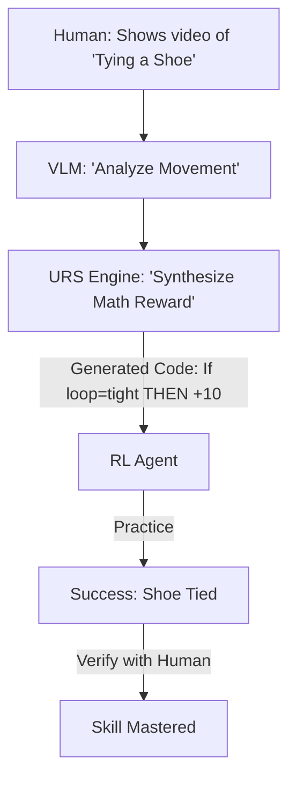

# URS (Universal Reward Synthesis)

🌟 **Created**: 2026 (The End of the Programmer)
👤 **Key Creator**: Google DeepMind / OpenAI
🏷️ **Tags**: `🚀 Breakthrough`, `🧠 Meta-Learning`, `🎨 Creative`

🧠 **What does this do? (The Analogy)**
Think of a **Person who can learn how to do anything just by watching a 5-second video**. 
- Old AI (Standard RL) requires a human to write a 1,000-line Python script to define the "Reward." 
- **URS** is an AI that **Writes its own reward code**. 
- You show it a video of a person "Folding a T-shirt." 
- The AI "Looks" at the pixels and "Writes" the math that represents a perfectly folded shirt. 
It turns "Human Intent" (Visual/Verbal) into "Machine Language" (Math) automatically.

🔍 **Step-by-Step Explanation:**
1. **Multi-Modal Perception**: The AI analyzes the user's video or verbal description.
2. **Reward Synthesis**: It generates a "Neural Reward Model" that detects success.
3. **Automatic Verification**: The AI tests its own reward function to make sure it's not "Cheatable."
4. **Benefit**: **Infinite Tasks**. You can teach a robot to do 1,000 new things a day just by showing it examples.

⚠️ **Issue Solved:**
**The Reward Bottleneck**. Writing reward functions is the hardest part of RL. URS makes it as easy as "Pointing a Camera."

❓ **Is this really needed?**
**YES**. For "God-level" AI to be useful in the home and the factory, it must be "User-Trainable." A normal person cannot write code; they need URS to "Show" the AI what to do.

🌍 **Real-World Use:**
1. **Home Robots**: "Show" the robot where you want the trash put once, and it learns the reward.
2. **Complex Manufacturing**: Showing an AI a "Perfect Weld" and having it learn to reproduce it.
3. **Sports Training**: Showing an AI a "Perfect Swing" and having it act as an automated coach.

📊 **High-Level Design (HLD)**

✅ **Point for "God-Level" AI:**
A "God" AI must be **Self-Sufficient** (Infinite Learning). URS is the final piece of the puzzle. It allows the AI to learn any task in the universe without a single line of human code. It is the bridge to a world where AI is as easy to teach as a human child, but with the power of a machine.
