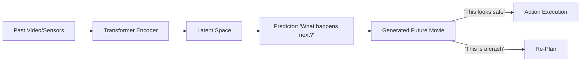

# WMT (World Model Transformers)

🌟 **Created**: 2025 (The Year of Video-as-Experience)
👤 **Key Creator**: Meta AI / Google DeepMind
🏷️ **Tags**: `👑 SOTA`, `🔮 Model-Based`, `🎬 Generative`

🧠 **What does this do? (The Analogy)**
Think of a **Director who can visualize an entire movie in their head before filming a single scene**. 
- Old AI (Standard Model-Based) predicts the next "Photo" (Frame). 
- **WMT** predicts the entire **"Movie"** (Sequence). 
- It uses the power of **Transformers** to understand the long-term relationships between objects in the world. 
- If the AI sees a ball flying toward a window, it doesn't just guess the next position; it "sees" the glass shattering, the sound, and the consequences.

🔍 **Step-by-Step Explanation:**
1. **Latent Encoding**: Turning the world (Pixels/Sensors) into a compact mathematical code.
2. **Transformer Prediction**: Using "Attention" to predict how that code changes over 1,000 steps.
3. **Generative Dreams**: The AI "Plays" its own future video to learn what is safe and what is dangerous.
4. **Policy Tuning**: It trains its "Body" (The Agent) entirely inside these generated dreams.

⚠️ **Issue Solved:**
**Short-sightedness**. Small world models forget the past. WMT uses the infinite memory of Transformers to remember that "The key is in the other room" even after 10,000 steps.

❓ **Is this really needed?**
**YES**. For "God-level" AI to navigate the real world, it must have a perfect "Intuition" for physics and cause-and-effect. WMT is the first step toward a "Digital Physics Engine" in an AI's brain.

🌍 **Real-World Use:**
1. **End-to-End Self-Driving**: Imagining 30 seconds into the future to avoid a crash.
2. **Industrial Robots**: Visualizing the entire assembly of a car before starting.
3. **Gaming**: Creating infinite, consistent NPC behavior based on "World Dreams."

📊 **High-Level Design (HLD)**

✅ **Point for "God-Level" AI:**
A "God" AI must be **Omniscient** (All-Seeing). By dreaming through trillions of simulated futures, WMT gives the AI a level of experience that no human could ever achieve in a single lifetime.
